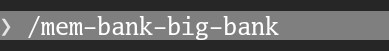
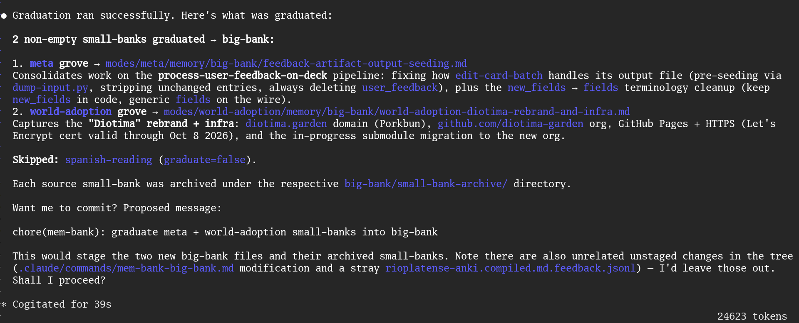

# Mneme — Narrative Extraction Memory Engine

*Mneme* is a recursive acronym: **M**neme **N**arrative **E**xtraction **M**emory **E**ngine. Self-contained memory-management subsystem. Captures per-session summaries during a Claude Code session and graduates them into a durable archive when work on a topic concludes.

Graduation is user-triggered (run `/mem-bank-big-bank` while on the feature branch, before merging into master). The graduated `<topic>.md` then travels into master as part of the normal merge — no git hook involved.

## Example: graduation in action

Invoke the slash command while on your feature branch:



The graduation run iterates every bank in `subscriptions.json`, summarizes each non-empty `small-bank.md` into a `big-bank/<topic>.md`, archives the source, and skips banks whose per-bank filter opts out (`graduate=false`):



## Subsystem files (this repo)

| Path | What |
|---|---|
| `./registry.py` | Bank registry primitive. `load_banks`, `bank_effective_patterns`, `bank_small_bank_path`, `bank_archive_dir`, `populated_banks`. Imported by `small-bank.py` and `big-bank.py`. |
| `./small-bank.py` | SessionEnd hook. Reads subscriptions, matches each bank's pattern against the transcript, spawns a single detached `claude -p` worker that appends a 2–4-sentence summary to all matched banks. |
| `./big-bank.py` | Graduation script. In `--subscriptions` mode, iterates all banks, graduates each non-empty `small-bank.md` into `big-bank/` via Sonnet. Explicit `--source/--archive-dir/--backup-dir` mode retained for one-off use. |
| `./small-job-worker.py` | Detached worker spawned by the SessionEnd hook. Reads `small-jobs.json`, summarizes the session via an isolated Claude call, and appends the result to each matched bank's `small-bank.md`. |
| `./mem-bank.log` | Runtime log for capture and graduation. Tab-delimited. Gitignored. |
| `./small-jobs.json` | JSON array of `{"target", "prompt"}` jobs written by the hook, read by the worker. One entry per matched bank. Gitignored, overwritten each fire. |

`subscriptions.json` is host config, not part of this repo — see "Consumer contract" below.

## Bank directory convention

Each bank lives at a fixed path and follows this layout:

```
<bank>/
├── context.md           # entry point; reading it is the default trigger pattern
├── this-bank-prompt.md  # optional: per-bank capture filter (see below)
├── small-bank.md        # append-only session log (gitignored)
└── big-bank/            # graduation archive and backups
    └── <topic>.md
```

To register a new bank add one entry to `subscriptions.json`:
```json
{ "name": "spanish", "bank": "<directory where the bank resides>" }
```
The default trigger pattern is `<bank>/context\.md`. Override with `"patterns"` for broader matching.

### Per-bank capture filter (`this-bank-prompt.md`)

If `this-bank-prompt.md` is present in the bank directory, its contents are injected into the summarization prompt as a `BANK FILTER` rule — evaluated before the session data. Use it to exclude irrelevant sessions from a bank.

The filter instruction should describe what qualifies for capture. The script automatically appends: *"If this filter excludes the session, respond with exactly SKIP."* Workers that receive `SKIP` log the exclusion and skip appending.

Example (`<grove>/languages/spanish/reading-log/this-bank-prompt.md`):
```
This is the Spanish reading history bank. Only capture if the session involved
selecting a book to read or reporting back on a completed book. Sessions about
card creation or vocabulary should be excluded.
```

## Consumer contract

This repo is a submodule, not a standalone tool — a host project must wire it in:

1. **Submodule it in**, at any mount path (e.g. `.claude/mem-bank`). It nests two submodules
   of its own (`utils/`, `session_crawler/`) — after adding, run
   `git submodule update --init --recursive` and verify both populate.
2. **Provide your own `subscriptions.json`** outside this repo (a sibling directory, not
   inside the mount path — this repo does not ship one). One entry per memory bank: `name`,
   `bank` (directory), optional `pattern`/`patterns` override.
3. **Wire the SessionEnd hook** in `.claude/settings.json`, pointing `--subscriptions` at
   your file:
   ```
   python3 <mount>/small-bank.py --subscriptions <path-to-your-subscriptions.json>
   ```
   Allowlist `python3 <mount>/big-bank.py:*` and `python3 <mount>/small-job-worker.py*`.
4. **Wire your own slash commands** (e.g. `/mem-bank-big-bank` running
   `big-bank.py --subscriptions <path-to-your-subscriptions.json>`).
5. **Gitignore runtime artifacts** produced under the mount path: `mem-bank.log`,
   `small-jobs.json`.

## Merge dynamics

Small-bank and big-bank have different persistence models:

| | `small-bank.md` | `big-bank/<topic>.md` | `big-bank/small-bank-archive/` |
|---|---|---|---|
| Tracked in git | No (gitignored) | Yes | Yes |
| Travels with merges | No | Yes | Yes |
| Touched by branch switch | No | Yes | Yes |

**Small-bank is local-only.** Git never touches it — no merge conflicts, no accidental deletion via merge. It lives only on the current machine's working tree until graduation.

**The workflow is: develop → graduate → merge.**

1. Develop on a feature branch. SessionEnd captures summaries into `small-bank.md`.
2. Before merging, run `/mem-bank-big-bank`. This graduates `small-bank.md` into `big-bank/<topic>.md`, archives it to `big-bank/small-bank-archive/`, and deletes `small-bank.md`.
3. Commit the new big-bank files and merge. The graduated entries travel into master normally.

**If you merge without graduating first:** your ungraduated small-bank entries are not lost — they survive on disk (git doesn't touch gitignored files). Run graduation at any point to recover them. The only way to lose them is `git clean -fdx`.

